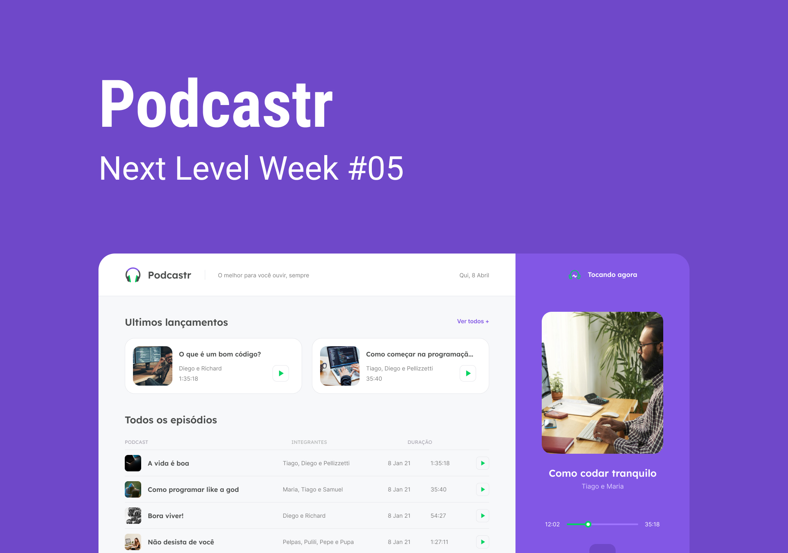

<h1 align="center"> Podcastr </h1>

<h1 align="center">   </h1>

## About

**Podcastr** was developed during **Next Level Week** (NLW), an event offered by **[Rocketseat](https://rocketseat.com.br/)**

## Technologies used 

Podcastr was developed with the following technologies:

- [ReactJS](https://pt-br.reactjs.org/)
- [Next.js](https://nextjs.org/)
- [Typescript](https://www.typescriptlang.org/)

## Podcastr Installation

```bash

    # Clone repository
    $ git clone https://github.com/HenriqueHS19/podcastr.git

    # Enter the directory
    $ cd podcastr/web

    # Installation of dependencies
    $ yarn

    # Start sever
    $ yarn server

    # Start application
    $ yarn dev
```